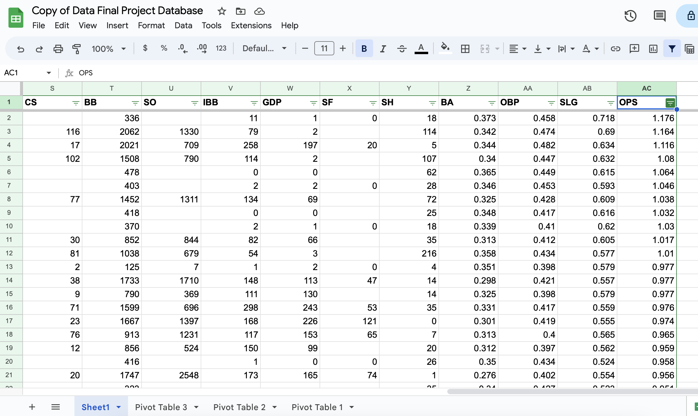
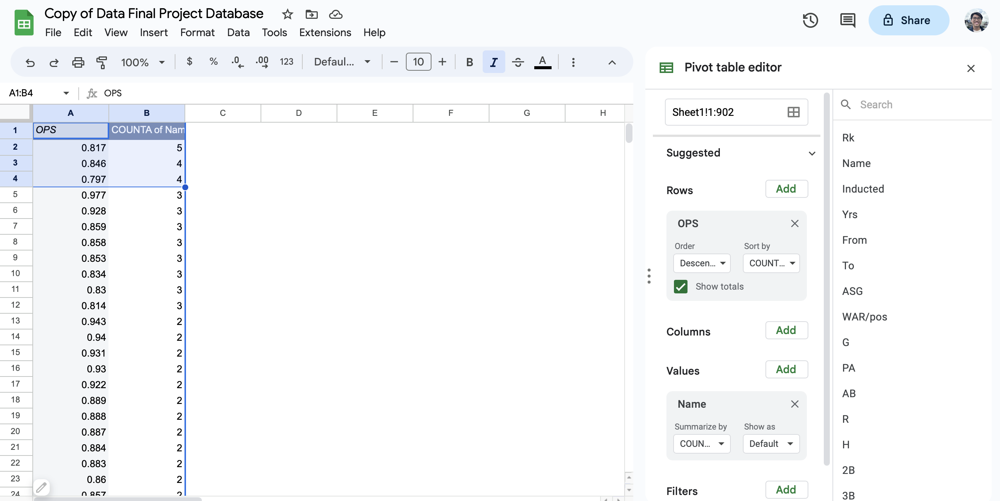
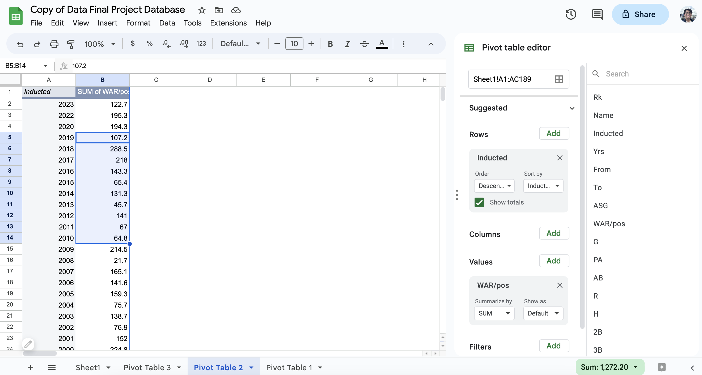
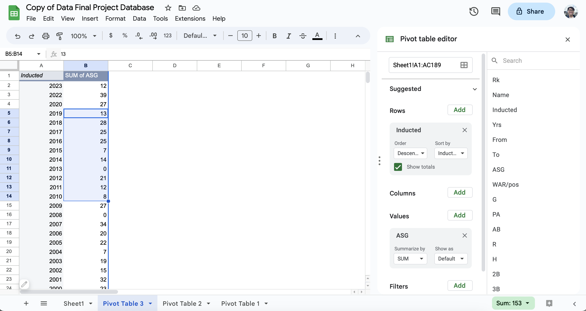
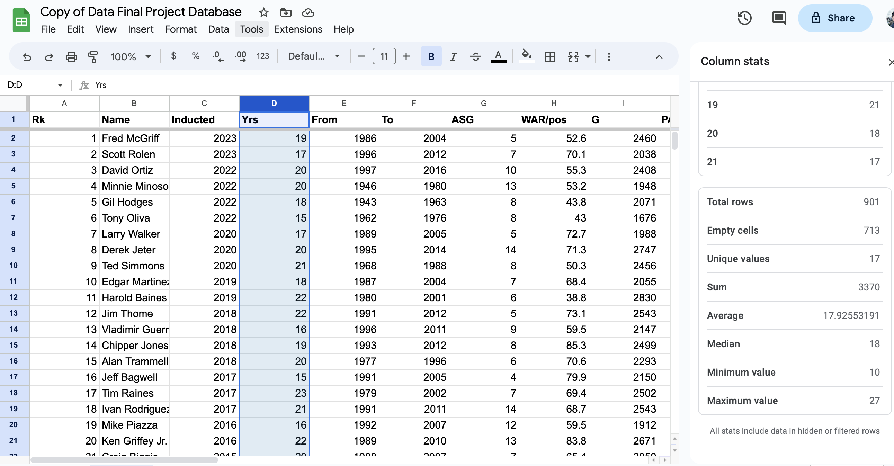

# J124 Intro to Data Journalism Final Project: A Data-Driven Look Into The Baseball Hall of Fame
## By Kyle Ngo
Download and make your own personal copy of the [database](Data_Final_Project_Database.csv) in Google Sheets. This data originally comes from [Baseball-Reference](https://www.baseball-reference.com/awards/hof_batting.shtml), but since the database included pitchers' hitting stats and people inducted into the Hall of Fame for other roles, like managers, I have cleaned the data to only include position players who have been inducted into the Hall of Fame for their excellent playing careers.

#### Before You Read
Baseball has some complex statistics, and I think it is important to explain the ones I'll be investigating. First, WAR/pos stands for Wins Above Replacement for position players. Essentially, this statistic evaluates how many wins a player will add to a team compared to if a replacement-level player played instead. The replacement-level player is around minor-league or fringe MLB level, and it shows how much more value a player would provide. The other prominent statistic I will look at is OPS, or On-base Plus Slugging. This adds together On-Base Percentage and Slugging Percentage. On-Base Percenatage takes the amount of times a player reaches base on a hit, walk, or hit by pitch, and divides it by the amount of plate appearances. Slugging assigns a value to a hit (1 for single, 2 for double, 3 for triple, and 4 for home run), adds up the amount of "total bases" and divides it by the number of at-bats. These two percentages added gives OPS. The last statistic that gets mentioned is ASGs, or All-Star Games. All of the other statistics in the database will not be used in this project, but are explained further on the Baseball-Reference page.

### Data Analysis
#### 1. Out of those in the dataset, who had the highest OPS, the lowest OPS, and the median OPS?
1. Click the Filter button and click the three lines next to OPS in column AC.
2. Sort A->Z to find the lowest OPS, who should be Luis Aparicio with a 0.653.
3. Sort Z->A to find the highest OPS, who should be Josh Gibson with a 1.176.
4. With the column AC selected, go to the Data tab -> Column Stats -> Median. The median should be 0.8405, which is right in between three players: Carl Yastrzemski and Cap Anson at 0.841, and Cool Papa Bell at 0.840.

#### 2. What were the top three most common values of OPS and WAR/pos?
1. Create a Pivot Table (Insert -> Pivot Table) encompassing the entire spreadsheet.
2. Put OPS as rows, Name as values.
3. Under the OPS box in rows, change "sort by" from "OPS" to "COUNTA of Name" and change "order" to Descending.
4. The top three most common values of OPS should be 0.817, 0.846, and 0.797.
5. Do the same for WAR/pos, just with all instances of OPS being replaced by WAR/pos.
6. The most common value of WAR/pos is a four-way tie between 68.4, 59.5, 48, and 47.7.

#### 3. How does the average WAR/pos for those inducted in the 1990s (1990-1999) compare to those inducted in the 2000s (2000-2009) and those inducted in the 2010s (2010-2019)?
1. Create a new Pivot Table.
2. Put Inducted as rows, WAR/pos as values.
3. Add up the total WAR/pos values for each year in the 90s (1990-1999). This should equal 991.3.
4. Divide by 15 inductees to get an average WAR/pos of 66.08 in the 90s.
5. Do the same for the 2000s. The total WAR/pos for the decade should be 1,370.3.
6. Dividing by 24 should give an average WAR/pos of 57.1 for the 2000s decade.
7. Do the same for the 2010s. The total WAR/pos for the decade should be 1272.2.
8. Dividing by 19 should give an average WAR/pos of 67 for the 2010s decade.
9. Based on this, we can see that the inductees in the 2000s had a much lower average WAR/pos than the inductees in either the 90s or the 2010s, likely due to the uptick in inductees compared to the other two decades.

#### 4. What is the percent change in average ASGs per year from the 2000s inductees to the 2010s inductees?
1. Create a new Pivot Table
2. Put Inducted as rows, ASG as values.
3. Add up the total number of ASGs from 2000-2009 and 2010-2019, which should give you 199 and 153.
4. Divide the 2000s value by 25 and the 2010s value by 19 to give you 7.96 average ASGs for the 2000s and 8.05 average ASGs for the 2010s.
5. Then, do (New - Old) / New, or (8.05-7.96)/8.05, times 100, to give a percent change of 1.12%.

#### 5. Find the mathematical average of every statistical column.
1. Go to Data -> Column Stats.
2. Scroll to find "Average."
3. Record this value for each column, besides Rk, Name, Inducted, From, and To.
4. The row should have these values.  

| Yrs   | ASG  | WAR/pos | G    | PA   | AB   | R    | H    | 2B  | 3B | HR  | RBI  | SB  | CS | BB  | SO  | IBB | GDP | SF | SH | BA    | OBP   | SLG   | OPS   |
|-------|------|---------|------|------|------|------|------|-----|----|-----|------|-----|----|-----|-----|-----|-----|----|----|-------|-------|-------|-------|
| 17.93 | 6.21 | 63.03   | 2046 | 8603 | 7551 | 1267 | 2283 | 395 | 98 | 217 | 1176 | 210 | 70 | 870 | 781 | 90  | 147 | 67 | 93 | 0.304 | 0.378 | 0.469 | 0.847 |

### Data Visualization
This [data visualization](https://www.datawrapper.de/_/B1qrO/) is a scatterplot comparing the WAR on the y-axis to the OPS on the x-axis for all of the position players in the Hall of Fame. Average lines are at 60 WAR and 0.850 OPS.  

### The Pitch
  The Baseball Hall of Fame is the most notorious one out of all the major sports. Thanks to the sport's long history and the players riddled with controversies throughout the decades, discussion surrounding who should and should not be inducted into the Hall of Fame will never die. Although many people online prefer to use the "eye test" or simply vibes to feel if a player should be inducted or not, baseball's plethora of statistics lends itself extremely well to data-driven analysis of the Hall of Fame. Using Baseball-Reference's register of Hall of Fame hitters and their stats, I picked out two of the more crucial, all-encompassing stats from the bunch: WAR (Wins Above Replacement) and OPS (On-Base Plus Slugging). I found the mathematical average of these two values to be 63 WAR and 0.847, but after adjusting for a few outliers, the solid averages that I came up with were 65 WAR and 0.850 OPS (as reflected in the visualization).   
  The scatterplot puts the various averages found in the Data Analysis questions into a digestible graph. The top-right quadrant is filled with some of the best players of all time, such as Babe Ruth. The players in the bottom-right quadrant have high OPS, but low WAR, meaning they played fewer games than most others, but were extremely good when they did play. The players in the top-left quadrant have lower OPS than average, but above-average WAR, mostly due to either extremely long playing careers or stellar defense. The bottom-left corner is the questionable zone: the players here likely should not be in the Hall, at least not for what they brought at the plate or in the field. We can use the average lines to project whether or not a current player will make it into the Hall of Fame. Being on the top-right quadrant almost guarantees induction, being in the top-left or bottom-right gives you a solid chance, and being in the bottom-left will make it difficult. With many players being right around those average lines, that is the sweet spot: ending your career somewhere between 0.800 and 0.900 OPS with 45-75 WAR would historically land you a spot in the Hall of Fame. Of course, this is a very surface-level evaluation, as it doesn't take career stats, records, or accolades into account — nonetheless, this is a simple, easy way to evaluate if a recently-retired player, or a player in the twilight of their career, is set to make it into the Hall of Fame.   
  As one example, we can take a look at Cincinnati Reds' first baseman Joey Votto. Votto is currently in his 17th season at the age of 39 and likely will retire soon. As it currently stands, Votto has 64.9 WAR and a career OPS of 0.924. Thus, he would be right at the average line for WAR, and pretty far to the right of the average line for OPS, almost around where Scott Rolen is on the scatterplot. As he has the opportunity to accumulate a couple more WAR in the last couple of years of his career, it is safe to say that based on these metrics, Joey Votto will be more than likely enshrined in the Hall of Fame in the future. Another example of a contentious player is Nelson Cruz. At 42 years old, it's clear that this is one of Cruz's final years. If he were to retire after this year, Cruz would have accumulated about 42.5 WAR to go with an 0.856 OPS in his career. Although the OPS is right on par with other Hall of Famers, that WAR number puts him below the average, and if it were based heavily on WAR, Cruz would be fighting an uphill battle to make it into the Hall of Fame. In this case, other context would be needed for Cruz, as his career home run numbers are in the top 40 all-time, behind a vast majority of Hall of Fame talents.   
  Boiling the Hall of Fame down to simply two statistics, when baseball has an entire ocean of data, seems counterproductive. However, basic analysis like using these two stats can make easy decisions quick, such as Joey Votto, and help people know when a player is possibly close but likely in need of some other context or stats, like Nelson Cruz.

### Possible Interviewees
#### Jon Heyman
Jon Heyman is on the BBWA (Baseball Writers of America) committee that votes to induct players into the Baseball Hall of Fame. Heyman is also a prominent baseball journalist, serving as a columnist for the New York Post and an MLB insider with MLB Network. Heyman would have great insight into how he and his colleagues evaluate their ballot of potential Hall of Fame inductees, along with what type of stats or circumstances they consider. His steadfast involvement in the current MLB as well as his historical view of older years can put stats and comparisons into perspective.
* https://twitter.com/jonheyman
* jonhheyman@aol.com
#### Steve Hirdt
Steve Hirdt is the Executive Vice President of the Elias Sports Bureau and the Senior Director of Operations and Research at Stats Perform. Steve is also a voter for the Baseball Hall of Fame, specifically on the Contemporary Baseball Era Committee, which votes on players who have been retired for 15+ years and missed the Hall of Fame on the normal ballot. With Steve’s highly statistically-minded background and outlook on his voting, he would be a great person to talk to about his insight on what type of stats and baselines he uses to choose Hall of Famers.
* https://twitter.com/stevehirdt?lang=en

### Two Additional Sources
* This [FiveThirtyEight article](https://fivethirtyeight.com/features/paul-goldschmidt-is-on-his-way-to-the-mvp-and-maybe-even-the-hall-of-fame/) discusses one current player, Paul Goldschmidt, and his chances of making it into the Hall of Fame as he enters the twilight of his career. It uses some more in-depth statistics to analyze his odds and would be a good additional source to get extra types of data and analysis.
* This [FanGraphs database](https://www.fangraphs.com/leaders.aspx?pos=all&stats=bat&lg=all&qual=y&type=6&season=2023&month=0&season1=1871&ind=0&team=0&rost=0&age=0&filter=&players=0&startdate=1871-01-01&enddate=2023-12-31&sort=12,d) shows the fWAR leaderboards for players in MLB history. fWAR calculates defensive value a bit differently than the WAR being used in this project and thus provides different values for players. With a different average fWAR line and current players having either higher or lower fWAR than WAR, this database would provide another lens to analyze a player and evaluate if they are worthy of the Hall of Fame or not.
